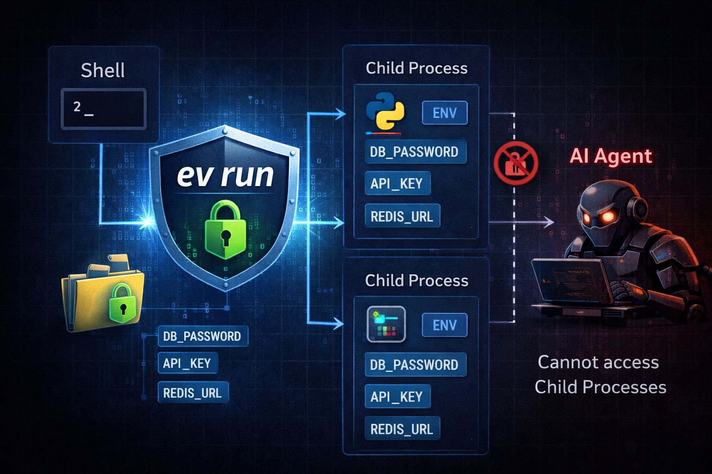

# ev

[](https://github.com/adrian-lorenz/ev/actions/workflows/test.yml)
[](https://github.com/adrian-lorenz/ev/actions/workflows/release.yml)
[](https://go.dev/)
[](#license)

**Local encrypted secret manager for modern AI-native development.**



`ev` moves secrets out of your repo, encrypts them locally, and gives them back only when your app actually runs.

- No `.env` files sitting next to code
- No daemon, no cloud, no background service
- Great DX for `uv`, `go`, `npm`, `terraform`, IDE run configs, and AI coding agents
- Optional `1Password` sync for encrypted off-site backup

## Why ev exists

AI coding agents can read your whole working tree. If secrets live in `.env`, `secrets.tfvars`, or `config.local.json`, they are part of that surface area.

`ev` keeps secrets outside the project and stores only a small `.envault` marker file in the repo.

```text
before                          after
----------------------------    --------------------------------
my-project/                     my-project/
  .env          <- visible        .envault      <- project name only
  app.py                         app.py
  ...                            ...

                                 ~/.envault/
                                   vault.json  <- encrypted vault
```

## Installation

### Homebrew (recommended)

```bash
brew install adrian-lorenz/ev/ev
```

### Install script (macOS / Linux)

```bash
curl -fsSL https://raw.githubusercontent.com/adrian-lorenz/ev/main/install.sh | bash
```

### Windows (PowerShell)

```powershell
iwr -useb https://raw.githubusercontent.com/adrian-lorenz/ev/main/install.ps1 | iex
```

Installs to `%LOCALAPPDATA%\ev\` and adds it to your `PATH` automatically. No admin required.

### Go install

```bash
go install github.com/adrian-lorenz/ev@latest
```

### Build from source

```bash
git clone https://github.com/adrian-lorenz/ev
cd ev
make build
```

## Uninstall

### Homebrew

```bash
brew uninstall ev
```

### Uninstall on macOS / Linux (install script)

```bash
sudo rm /usr/local/bin/ev
rm -rf ~/.envault
```

### Uninstall on Windows

```powershell
Remove-Item "$env:LOCALAPPDATA\ev" -Recurse -Force
# remove PATH entry if added manually
```

> **Migrating from install script to Homebrew?** Remove the old binary first to avoid having two versions:

```bash
sudo rm /usr/local/bin/ev
brew install adrian-lorenz/ev/ev
```

> Your vault at `~/.envault/` is untouched and will be picked up automatically.

## Quick Start

```bash
# install
brew install adrian-lorenz/ev/ev

# inside your project
cd my-project
ev init
ev import .env

# recommended workflow
ev open
ev run uv run python main.py

# or manage visually
ev manage
```

## Why it feels good to use

### `ev run` is the star

Instead of exporting secrets into your shell and hoping every subprocess inherits the right state, `ev run` injects them directly into the child process.

```bash
ev run uv run python main.py
ev run uvicorn main:app --reload
ev run go run .
ev run npm run dev
ev run terraform plan
```

That means:

- less shell pollution
- no copy-pasting secrets around
- great fit for IDE run configs
- especially nice with `uv`, where you often want one clean command that just works

When a session is open, `ev run` becomes the "set it and forget it" path for local development.

### `1Password Sync` is a strong companion

`ev` is intentionally local-first. But sometimes you still want an encrypted copy outside your machine, or a simple way to hand project secrets to teammates.

```bash
ev sync 1password --op-vault engineering
ev sync 1password --op-vault engineering --project my-api
```

`ev` pushes each project as a Secure Note in `.env` format:

```text
engineering
  ev: my-api
  ev: payment-service
  ev: infra
```

This is especially useful for:

- off-site backup
- team handoff
- keeping "what this project needs" in one shareable place

Sync is one-way: `ev -> 1Password`.

## Features

- AES-256-GCM encryption with Argon2id key derivation
- Secrets live outside the repo in `~/.envault/vault.json`
- `.envault` file contains only the project name and is safe to commit
- Session-based unlock flow with `ev open`
- HTMX management UI with `ev manage`
- Import from `.env`, `.tfvars`, and Terraform map blocks
- Automatic `TF_VAR_*` injection for Terraform
- macOS Keychain support
- Backup and restore built in
- Single binary, no daemon, no cloud dependency
- Secret scanner with `ev scan`

## Typical workflow

```bash
# 1. initialize once per project
ev init

# 2. add secrets
ev set DATABASE_URL
ev set OPENAI_API_KEY

# 3. unlock once
ev open

# 4. run tools with injected secrets
ev run uv run python main.py
ev run npm run dev
ev run terraform plan
```

`ev load` still exists when you want shell exports:

```bash
eval "$(ev load)"
```

But for most dev workflows, `ev run` is the cleaner path.

## Commands

| Command | Description |
| --- | --- |
| `ev init [name]` | Create `.envault` in the current directory |
| `ev info` | Show project, vault, session status, and usage hints |
| `ev set KEY [VALUE]` | Add or update a secret |
| `ev get KEY` | Print a secret value |
| `ev list` | List secret keys for the current project |
| `ev list projects` | List all projects in the vault |
| `ev load` | Output shell exports for `eval` or `source` |
| `ev run <cmd> [args...]` | Run a command with secrets injected |
| `ev delete KEY` | Remove a secret |
| `ev import <file>` | Import from `.env` or `.tfvars` |
| `ev sync 1password` | Push one or all projects to 1Password |
| `ev open [--ttl 8h]` | Unlock the vault for a timed session |
| `ev close` | Revoke the current session |
| `ev session` | Show current session status |
| `ev passwd` | Change the master password |
| `ev backup [file]` | Back up the vault |
| `ev restore <file>` | Restore the vault from a backup |
| `ev manage` | Start the local web UI |
| `ev keychain save|check|delete` | macOS Keychain integration |
| `ev scan [path...]` | Scan files for leaked secrets and credentials |

Global flags:

- `-p, --project <name>` to override the detected project
- `--vault <path>` to override the default vault path

## `ev run` vs `ev load`

### `ev run`

Best for day-to-day development:

```bash
ev open
ev run uv run python main.py
ev run pytest
ev run terraform apply
```

- injects secrets only for the command you launch
- keeps your shell environment cleaner
- works well in IDEs and scripts

### `ev load`

Still useful when you want an interactive shell with secrets already exported:

```bash
eval "$(ev load)"
python main.py
```

## Sessions

Unlock once and keep moving:

```bash
ev open
ev open --ttl 4h

ev session
ev close
```

Once a session is active, commands like `ev run`, `ev get`, and `ev load` stop prompting for your password.

Changes from `set`, `delete`, `import`, and the web UI automatically refresh the session data.

## Import existing secrets

### From `.env`

```bash
ev import .env --dry-run
ev import .env
rm .env
```

Supported:

```bash
DB_HOST=localhost
DB_PASSWORD="my secret"
export API_KEY=sk-abc123
```

### From `secrets.tfvars`

```bash
ev import secrets.tfvars --dry-run
ev import secrets.tfvars
rm secrets.tfvars
```

Terraform gets special treatment:

```bash
ev run terraform plan
```

For every secret, `ev` also sets a matching `TF_VAR_<key>` environment variable when the target command is Terraform.

## Web UI

```bash
ev manage
```

Starts the local UI on [http://localhost:7777](http://localhost:7777).

You can:

- browse projects
- add, reveal, edit, and delete secrets
- make changes offline on `127.0.0.1` only

## 1Password sync

Requirements:

- [1Password CLI](https://developer.1password.com/docs/cli/) installed
- signed in via `op signin`

Examples:

```bash
# choose a vault interactively
ev sync 1password

# sync everything to a specific vault
ev sync 1password --op-vault engineering

# sync one project only
ev sync 1password --op-vault engineering --project my-api
```

Each note is named `ev: <project-name>` and contains the secrets in `.env` format.

## Project detection

`ev` resolves the active project in this order:

1. `--project`
2. nearest `.envault` found by walking upward
3. current directory name

The upward search stops at a `.git` boundary, so it behaves a bit like Git and avoids leaking into unrelated parent repos.

## Shell and IDE integration

### bash / zsh

```bash
eval "$(ev load)"
```

Optional helper:

```bash
evload() { eval "$(ev load "$@")"; }
```

### fish

```fish
ev load --shell fish | source
```

### direnv

Put this in `.envrc`:

```bash
eval "$(ev load)"
```

### IDEs

A very comfortable setup is:

```bash
ev open
```

Then use commands like this in your run configuration:

```bash
ev run uv run python -m uvicorn main:app --reload
```

## Backup and restore

```bash
ev backup
ev backup ~/Desktop/ev.bak

ev restore ~/.envault/backups/vault-2026-03-16T12-00-00.json
```

`ev restore` creates a pre-restore backup before overwriting the active vault.

`ev passwd` also creates a backup before changing the master password.

## Scanning for leaked secrets

`ev scan` walks your project files and flags anything that looks like a leaked credential — before it ends up in git or gets passed to an AI coding agent.

```bash
# scan current directory
ev scan

# scan a specific path
ev scan ./src

# save a plain-text report
ev scan --report report.txt
```

Exit code is `1` when findings are present, so it works in CI:

```yaml
- run: ev scan
```

**What gets detected:** 160+ patterns for API keys, tokens, passwords, database URLs, and cloud credentials (AWS, GCP, Azure, OpenAI, GitHub, Stripe, and many more).

**Skipped automatically:** dot-directories (`.git`, `.idea`, `.venv`, …), binary files, files larger than 10 MB.

**Suppressing false positives:** add `# noscan` or `// noscan` anywhere on a line to exclude it:

```python
EXAMPLE_KEY = "sk-ant-api03-notarealkey..."  # noscan
```

```
ev scan
────────────────────────────────────────────────────────────

config/settings.py
  HIGH  config/settings.py:12:14  openai-api-key  sk-proj******…
  HIGH  config/settings.py:18:9   aws-access-key  AKIAZ0*******…

────────────────────────────────────────────────────────────
2 finding(s) across 1 file(s)  (38 files scanned)
```

## Security

| Property | Detail |
| --- | --- |
| Encryption | AES-256-GCM |
| Key derivation | Argon2id |
| Vault path | `~/.envault/vault.json` |
| Storage permissions | vault `0600`, directory `0700` |
| Writes | atomic temp-file + rename |
| Sessions | encrypted files in `~/.envault/sessions/` |
| Web UI | local only on `127.0.0.1` |
| Password handling | prompt only, never via CLI flags |

The master password is not stored by default. If you lose it, there is no recovery.

## License

MIT
